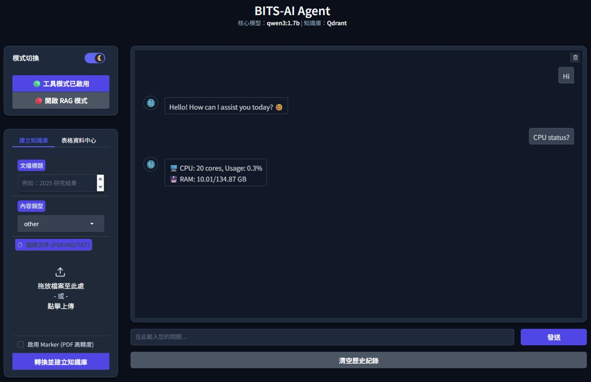

<p align="center">
  
</p>

---------------------------------------
# BITS-AI: A RAG & MCP-Integrated AI Agent Platform for Labs

BITS-AI is a private laboratory AI agent integrating LLMs with hybrid RAG to optimize technical search and protocol understanding. It serves as an intelligent research assistant featuring multi-format file support, tool orchestration. Also, BITS-AI integrate the MCP server for data retrieval. 

## User Interface
 

## How to start?
To access the BITS-AI agent Interface, run the main execution file:
```Python
python -u bitsAI_app.py
```
Three Modes of Operation:
* **Normal**: Standard chat mode with no additional features enabled.
* **Tools**: Enables the `開啟工具模式` toggle to call specific system utilities (see Available Tools below for details).
* **RAG**: Enables the `開啟 RAG 模式` toggle to perform Retrieval-Augmented Generation based on your stored data.

Note on `建立知識庫` File Upload:
* **Default**: Uses **MarkItDown** for fast conversion.
* **Enhanced Accuracy**: Toggle the **Marker** button for more precise results (Note: This process is slower).

Note on `表格資料中心` File Upload:
* **Usage**: Your CSV files will upload to folder for local MCP server [MotherDuck](https://github.com/motherduckdb/mcp-server-motherduck).

## Simply manage the Vector database
You can delete the chunks or modify the metadata:
```Python
python -u bitsAI_qdrant_db_admin.py
```

## Available Tools
The main tools here integrate MCP server [MotherDuck](https://github.com/motherduckdb/mcp-server-motherduck) for data retrieval:

* Turn on the `開啟工具模式` first.
* Prompt example 1: 
  ```markdown
  > List the files.

  # --- Output ---
  The files in /YourPath/data_storage are: 
  CSV_1.csv (0.1 MB)
  CSV_2.csv (0.2 MB)...
  ```
* Prompt example 2: 
  ```markdown
  > CSV_1.csv head 3 rows.

  # --- Output ---
  Here are the first 3 rows from CSV_1.csv: 
  +----+--------+-----+-----------+---------------------+
  | ID | Name   | Age | Country   | Email               |
  +----+--------+-----+-----------+---------------------+
  | 1  | Name_1 | 62  | Country_1 | email_1@example.com |
  | 2  | Name_2 | 48  | Country_2 | email_2@example.com |
  | 3  | Name_3 | 61  | Country_3 | email_3@example.com |
  +----+--------+-----+-----------+---------------------+
  ```
* Prompt example 3: 
  ```markdown
  > CSV_1.csv column Age average value

  # --- Output ---
  The average value of the "Age" column in `CSV_sample.csv` is 44.53.
  ```

You can turn on the `開啟工具模式` button to operate the other tools:
<details> <summary>System Health Related question</summary>
  
  * "What is the current status of the system?"
  * "How much RAM is currently being used?"
  * "Is the CPU under heavy load right now?"
  * "How much disk space is left on the root drive?"
  * "Give me a quick summary of the system hardware usage."
</details>

<details> 
<summary>System Health Related question</summary>

  * "What is the current status of the system?"
  * "How much RAM is currently being used?"
  * "Is the CPU under heavy load right now?"
  * "How much disk space is left on the root drive?"
  * "Give me a quick summary of the system hardware usage."
</details>

<details>
<summary>GPU Status Related questions</summary>

  * "Is there an NVIDIA GPU available?"
  * "What is the current GPU temperature? Is it overheating?"
  * "Is the GPU being utilized right now, or is it idle?"
  * "Check the load on all available graphics cards."
</details>

<details> <summary>Resource Audit Related question</summary>
  
  * "Which processes are consuming the most CPU?"
  * "Find the top 3 memory-hogging applications."
  * "Who is running the most resource-intensive task right now?"
  * "List the top 3 scripts that are slowing down the system."
</details>

<details> <summary>Time Context Related question</summary>
  
  * "What time is it now?"
  * "What day of the week is it?"
  * "Give me the current timestamp for the log."
</details>
